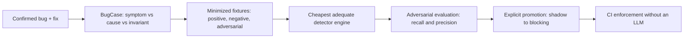

# Bug Corpus

<div align="center">

**A compiler from historical bugs into permanent deterministic detectors.**

[](https://github.com/carterlasalle/bugcorpus/actions/workflows/bugcorpus.yml)


[](LICENSE)

[Quick start](#quick-start) · [Agent workflow](#agent-workflow) · [Architecture](#architecture) · [Coverage matrix](#coverage-matrix) · [Agent adapters](#agent-adapters) · [Decisions](docs/adr/) · [Contributing](#contributing)

</div>
<!-- trace:v1 id=doc.bugcorpus-readme work=WORK-BUG-ZJBDCZZ0 -->

Bug Corpus gives a repository the operating model of a team that never makes the same class of mistake twice — without an LLM at scan time, without a markdown bug diary, and without one giant Semgrep config. A confirmed bug becomes a structured BugCase, a minimized reproducer, a stated invariant, and finally a deterministic detector that runs in CI. Every later instance of that bug class is caught automatically.

## How it works

<!-- trace:v1 id=doc.bugcorpus-readme-how work=WORK-BUG-ZJBDCZZ0 -->



BugCase records are the source of truth. Generated indexes (`corpus-index.json`, `detector-index.json`, `coverage-matrix.json`) are derived artifacts; they are regenerated, never hand-edited. Findings carry stable fingerprints, so CI distinguishes new violations from tracked debt.

## Capabilities

<!-- trace:v1 id=doc.bugcorpus-readme-capabilities work=WORK-BUG-ZJBDCZZ0 -->

| Area | What Bug Corpus provides |
|---|---|
| Corpus | Stable `BC-NNNNNN` records, symptom/root-cause/invariant separation, semantic signatures, families, detector lineage, history mining |
| Synthesis | Evidence packs, cheapest-engine ladder, positive/negative/adversarial fixtures, recall and precision metrics, explicit promotion |
| Scanning | Eight engine adapters, `fast`/`pr`/`full` profiles, full/diff/targeted scopes, suppressions, baselines, SARIF export, stable fingerprints |
| Agents | One canonical skill, verified OMP/Claude/Codex adapters, cheap post-edit hooks, stop-time reminders, MCP server |
| CI | Fixture verification, PR scans, full scheduled scans, blocking gates, coverage matrix artifact |

## Quick start

<!-- trace:v1 id=doc.bugcorpus-readme-quickstart work=WORK-BUG-ZJBDCZZ0 -->

### Prerequisites

- Python `>=3.11`
- [`uv`](https://docs.astral.sh/uv/)
- Git

```sh
uv sync
uv run bugcorpus doctor     # tool capabilities
uv run bugcorpus verify     # validate corpus + detector fixtures
uv run bugcorpus scan       # run promoted detectors (add --json for machines)
```

## Install

<!-- trace:v1 id=doc.bugcorpus-readme-install work=WORK-BUG-ZJBDCZZ0 -->

Bug Corpus is per-repo: the tool installs once, and each repository gets its
own corpus. No account, daemon, or network service is required. One command
installs everything the repo needs — corpus scaffold, skills, commands,
hooks, and MCP entries — then you just open and run:

```sh
pipx install bugcorpus        # or: uv tool install bugcorpus
cd your-repo
bugcorpus init
```

From a source checkout the same flow is `uv run bugcorpus init`.
`init` is idempotent: re-running it refreshes adapters without touching
corpus records.

```sh
git clone <your-fork-or-this-repo> && cd bugcorpus
uv sync
uv run bugcorpus adapters install --check   # verify sync (also runs in CI)
```

Staying current: after upgrading the tool (`pipx upgrade bugcorpus`),
refresh every enrolled repo in place:

```sh
cd your-repo
bugcorpus update              # reinstall adapters, regenerate indexes
```

`update` reports the running version and what it refreshed; hook commands,
MCP entries, and pointers are rewritten to the current invocation, so a repo
installed with `uv run bugcorpus` keeps working after you switch it to an
installed `bugcorpus` (or pin either form with `adapters install --bin ...`).

Per-harness, everything works from the checkout; each line is a trust step
owned by you, not by the installer:

- **Claude Code**: skill + `/bug-corpus` `/bug-learn` `/bug-scan` commands
  load automatically. Approve `.mcp.json` once when prompted. A SessionStart
  hook announces the verified load state (counts plus per-detector checks);
  the PostToolUse hook runs a silent fast scan after Python edits; the Stop
  hook reminds you only if the session fixed a bug without learning it.
- **Codex**: skill (explicit `$bug-corpus` or automatic) plus AGENTS.md
  pointer load automatically. Trust project hooks once
  (`/hooks` — see <https://learn.chatgpt.com/docs/hooks>); MCP entry in
  `.codex/config.toml` needs approval on first run.
- **OMP**: `.omp/extensions/bug-corpus` auto-loads: the same three slash
  commands plus the cheap post-edit scan. Restart the session after install.

Uninstall: `git clean` the installed paths (they are all listed by
`adapters install --check` problems when drifted) or keep the core and
delete the harness directories; `bugcorpus verify` and `scan` never need
any adapter present.

## Agent workflow

<!-- trace:v1 id=doc.bugcorpus-readme-workflow work=WORK-BUG-ZJBDCZZ0 -->

1. Fix the bug, prove the fix with normal tests.
2. `uv run bugcorpus learn --title "stale snapshot reused after await"`.
3. State symptom vs root cause vs violated invariant in `.bugcorpus/corpus/BC-NNNNNN/bug.yaml`.
4. Check for siblings before inventing a detector:
   `uv run bugcorpus search "snapshot await stale"`,
   `uv run bugcorpus related BC-000001`.
5. Synthesize the cheapest adequate detector, verify fixtures, attack it:
   `uv run bugcorpus synthesize BC-000001`,
   `uv run bugcorpus verify BC-000001`,
   `uv run bugcorpus scan --all`.
6. Promote explicitly, shadow first:
   `uv run bugcorpus promote stale-state-after-await-v1 --to warning`.

Detectors that fail fixture verification can never be `blocking` — `promote`
enforces 100% positive recall and zero negative false positives.

No human gate is required to close the loop: finish learn→promote in the same
session, open a PR, and set auto-merge so green CI merges it. The stop hook
captures an unlearned fix as a `proposed` draft automatically (never an
invariant — those need judgment), `promote --auto` advances every eligible
detector on thresholds alone, and Dependabot PRs auto-merge when green.

## Architecture

<!-- trace:v1 id=doc.bugcorpus-readme-architecture work=WORK-BUG-ZJBDCZZ0 -->

Five independent layers; the first three work with no agent installed.
Full design in [DESIGN.md](DESIGN.md); decisions in [docs/adr/](docs/adr/).

```text
bugcorpus/               Deterministic core: corpus, engines, scanner,
                         verifier, coverage, CLI, MCP server
.bugcorpus/corpus/       BugCase records (source of truth)
.bugcorpus/families/     Bug classes, independent of cases
.bugcorpus/detectors/    Promoted detectors + manifests with lineage
.bugcorpus/generated/    Regenerated indexes and coverage matrix
skills/bug-corpus/       Canonical agent skill (single source)
adapters/                Per-harness install sources (thin)
tests/bugcorpus/         Pytest suite; tests/bun/ OMP extension tests
.github/workflows/       verify + PR/full scans, CodeQL
```

Engine subprocesses are the only cross-process seam; every finding normalizes
to the internal Finding schema (SARIF is export-only). Adapters call the core;
the core never imports a harness.

## Coverage matrix

<!-- trace:v1 id=doc.bugcorpus-readme-coverage work=WORK-BUG-ZJBDCZZ0 -->

`uv run bugcorpus coverage` verifies every detector live and writes
`.bugcorpus/generated/coverage-matrix.json`: bugs × engines plus per-family rollups with
members, protecting detectors, known/adversarial recall, negative FP rate,
and promotion state.

```text
bug       exist    lex      agrep    semgrep  s-taint  codeql   pysa     custom
BC-000001                                                                ✓
BC-000002          ✓
```

## Safety model

<!-- trace:v1 id=doc.bugcorpus-readme-safety work=WORK-BUG-ZJBDCZZ0 -->

Bug Corpus intentionally makes weak detectors hard to promote:

- A crashing detector reports `detector-error`, never a clean scan.
- A historical fixture failing verification is never hidden by a baseline.
- `blocking` requires full positive recall, zero negative false positives,
  and full adversarial recall — enforced by `promote`, not by convention.
- Detector code is repository code: subprocess argv arrays, no shells, no
  untrusted interpolation, reviewed like source. See [SECURITY.md](SECURITY.md).
- Suppressions are structured and auditable (detector, fingerprint, reason,
  timestamp) — a detector bug until proven otherwise.

## Repository status

<!-- trace:v1 id=doc.bugcorpus-readme-status work=WORK-BUG-ZJBDCZZ0 -->

Protected, PR-only `master` with strict required checks (`verify`, `scan-pr`,
`analyze`). Solo-owner mode keeps direct pushes blocked without requiring a
second reviewer account. Dependabot updates `uv` and Actions weekly; CodeQL
analyzes Python on push, PR, and schedule. Secret scanning and push
protection are enabled. `ruff check`, `ruff format --check`, and `pyright`
run in CI alongside the test suite.

Only `blocking` detectors gate a build, and only on findings not already in
`.bugcorpus/baseline.json` (record known debt once with
`bugcorpus baseline --record`; fixture verification always ignores the
baseline). `warning` and `shadow` findings are surfaced, never failures —
if a scan reports findings yet exits 0, that is the design, and the scan
summary names each detector's state. Every PR also gets inline reviewdog
annotations from `bugcorpus export sarif` (advisory; the scan gate decides).

## Documentation

<!-- trace:v1 id=doc.bugcorpus-readme-docs work=WORK-BUG-ZJBDCZZ0 -->

| Document | Purpose |
|---|---|
| [DESIGN.md](DESIGN.md) | Problem, layers, key decisions, non-goals |
| [docs/adr/](docs/adr/) | Adapter strategy, detector protocol, fixture lineage, trace scope |
| [CONTEXT.md](CONTEXT.md) | Domain vocabulary: BugCase, family, detector, fixture, fingerprint |
| [CONTRIBUTING.md](CONTRIBUTING.md) | Setup, bug-plus-detector workflow, quality gates |
| [SECURITY.md](SECURITY.md) | Trust model, reporting, supply chain |
| [CHANGELOG.md](CHANGELOG.md) | Release history |
| [Agent guidance](AGENTS.md) | Repository-specific instructions for coding agents |
| [Skill](skills/bug-corpus/SKILL.md) | Canonical agent workflow with ladder/fixture/promotion references |

## Repo map

<!-- trace:v1 id=doc.bugcorpus-readme-map work=WORK-BUG-ZJBDCZZ0 -->

| Area | Path |
|---|---|
| CLI/core | `bugcorpus/` |
| Corpus state | `.bugcorpus/` |
| Canonical skill | `skills/bug-corpus/SKILL.md` |
| Adapter sources | `adapters/` |
| Tests | `tests/bugcorpus/`, `tests/bun/` |
| CI | `.github/workflows/bugcorpus.yml`, `codeql.yml` |

## Commands

<!-- trace:v1 id=doc.bugcorpus-readme-commands work=WORK-BUG-ZJBDCZZ0 -->

`init`, `learn [--from-worktree|--before|--after]`, `show`, `related`,
`search`, `family list|show`, `synthesize [--family]`, `verify [--detector]`,
`coverage` (bugs × engines plus family recall rollups, from live verification),
`scan [--all|--changed|--diff|--profile]`, `detector list|show|run`,
`promote --to`, `suppress`, `baseline [--record]`, `doctor`,
`export sarif`, `mine-history`, `mcp`, `hooks post-tool-use|session-stop|session-start`,
`community export|import|list|install|publish`.

## Agent adapters

<!-- trace:v1 id=doc.bugcorpus-readme-adapters work=WORK-BUG-ZJBDCZZ0 -->

One canonical skill (`skills/bug-corpus/SKILL.md`, Agent Skills frontmatter);
`uv run bugcorpus adapters install` copies it plus per-harness surfaces and
merges configs without clobbering. Everything works from a bare checkout:

| Harness | Shipped | Manual step |
|---|---|---|
| Claude Code | `.claude/skills/`, `.claude/commands/` (bug-corpus/learn/scan), settings hook merge, `.mcp.json` merge | approve MCP once |
| Codex | `.agents/skills/`, AGENTS.md pointer, `.codex/hooks.json`, `.codex/config.toml` MCP merge | trust project hooks |
| OMP | `.omp/skills/`, `.omp/extensions/bug-corpus/` (real extension: `/bug-corpus` `/bug-learn` `/bug-scan` + cheap post-edit scan) | restart session |

Post-edit hooks in every harness call `uv run bugcorpus hooks post-tool-use`:
fast-profile scan of the touched file, silent unless a warning/blocking
detector fires, always exit 0 (advisory — CI enforces). Session start runs
`uv run bugcorpus hooks session-start`, which announces the verified load
state (or stays silent outside enrolled repos). Details and alternatives in
`docs/adr/001-bare-checkout-adapters.md`.

## Community detectors

<!-- trace:v1 id=doc.bugcorpus-readme-community work=WORK-BUG-ZJBDCZZ0 -->

Detectors are portable. The long-lived `community` branch collects
shared detectors; contributions arrive as pull requests against it so
every shared detector gets a security review before anyone installs it.
Detectors are executable code — treat them like dependencies, not data.

```sh
# share one of yours (pushes your branch, opens a PR against community)
bugcorpus community export my-detector --output /tmp/share
bugcorpus community publish --base community
# use someone else's (always installs as shadow; promote locally after review)
bugcorpus community list --ref community
bugcorpus community install --ref community --detector their-detector
```

Rules: imports never land above `shadow` (fixtures must verify, otherwise
`draft`); id collisions with differing content refuse unless `--force`;
only minimized fixtures travel — production code stays in your repo. The
`community` branch is never merged into `main`, so shared code stays out
of default checkouts and CI until you curate it.

## Contributing

<!-- trace:v1 id=doc.bugcorpus-readme-contributing work=WORK-BUG-ZJBDCZZ0 -->

This repository uses protected, PR-only pull requests with required checks.
Read [CONTRIBUTING.md](CONTRIBUTING.md) before making changes. Run the test
suite and `uv run bugcorpus verify` before opening a pull request, and keep
`uv run bugcorpus adapters install --check` green when touching skills or
adapters.
